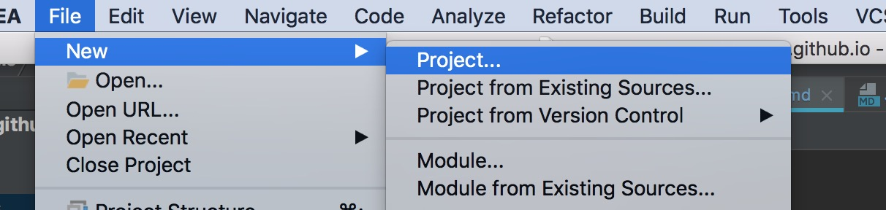
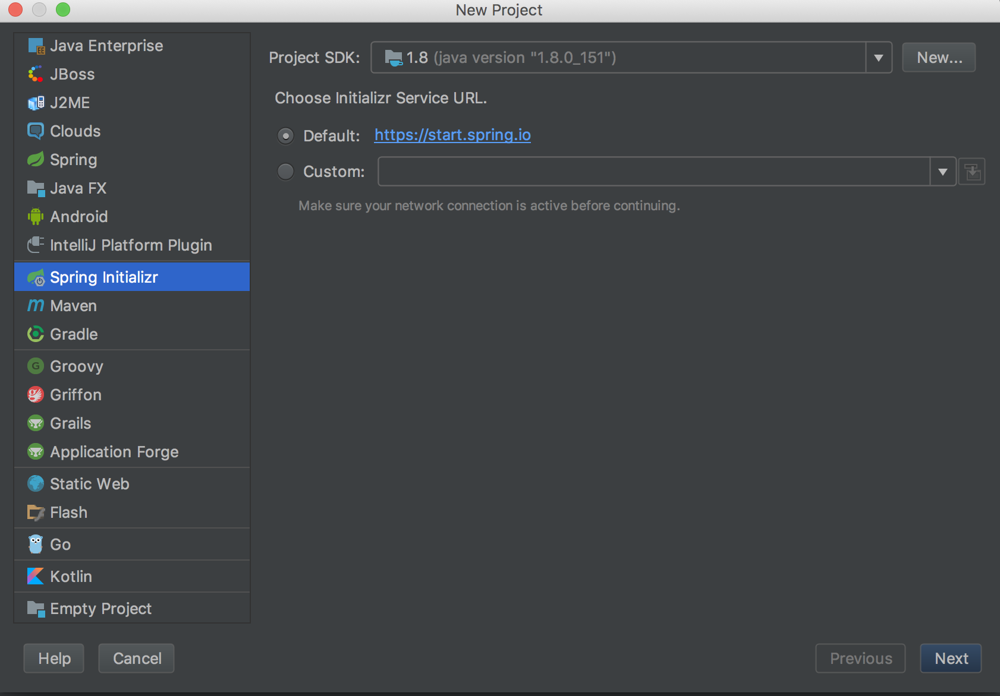

# SpringBoot 官方指南简译

## SpringBoot介绍

> Springboot旨在快速构建一个生产级别的spring应用，是spring框架对"约定优于配置"
的最佳实践产物。

## 快速开始

快速构建一个springboot项目，有多种途径，本文只介绍两种简单的方式

### start.spring.io

spring官方提供了一个简单的方式，可以直接下载一个springboot工程，然后导入到ide 里面
就可以进行开发了.该方式操作简单，只需要在官方提供的地址进行项目初始化的各项选择（springboot版本
，初始化的依赖、项目管理工具类型等），然后点击 `Generate Project` 即可下载到本地。

地址：[http://start.spring.io](http://start.spring.io)

### IntelliJ IDEA 构建

如果你使用 `IntelliJ IDEA` 作为开发工具，那么你也可以使用该工具安装`springboot`插件
以后，直接在工具内部创建一个`springboot`工程。

具体步骤：

    File -> new -> project
    


然后按照提示进行下一步操作即可



> 说明：在使用以上两种方式构建的时候，均可以进行初始的依赖选择，当然也可以在构建完基本的工程以后，
在修改pom.xml 文件来新增依赖。

### 运行springboot应用

在有了springboot工程以后，就可以通过`application.java` 文件 来启动并运行项目了，
（⚠️如果引入了持久层框架的依赖，则需要配置数据源，否则启动失败），
当然，这个时候启动应用访问的时候是会返回404的，这个时候我们需要编写一个测试的controller，
此处直接搬官网的例子过来

```java
package hello;

import org.springframework.boot.*;
import org.springframework.boot.autoconfigure.*;
import org.springframework.stereotype.*;
import org.springframework.web.bind.annotation.*;

@Controller
@EnableAutoConfiguration
public class SampleController {

    @RequestMapping("/")
    @ResponseBody
    String home() {
        return "Hello World!";
    }

    public static void main(String[] args) throws Exception {
        SpringApplication.run(SampleController.class, args);
    }
}

```

此时，启动项目后，在浏览器访问`localhost:8080` 应该会返回 "Hello World!"

## 配置文件详解

